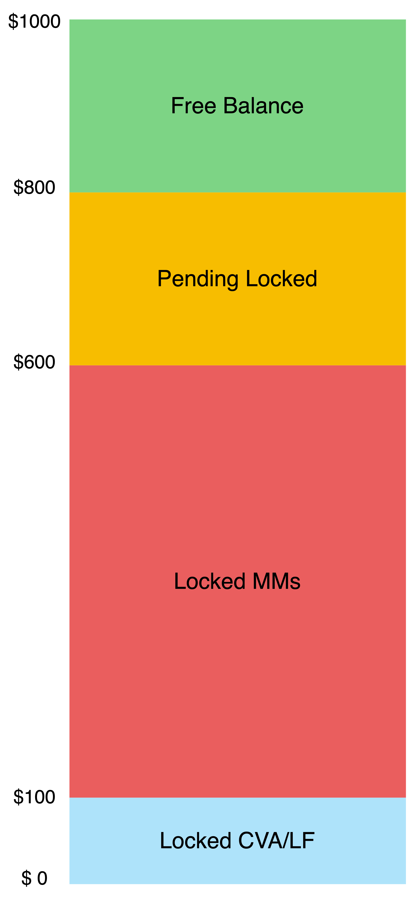

# SYMM I/O protocol implementation
### Table of contents
- [Introduction](#introduction)
- [Setup Instructions](#setup-instructions)
- [Main Flow](#main-flow)
  * [Deposit](#deposit)
  * [Send Quote](#send-quote)
  * [Party B sees the position request](#party-b-sees-the-position-request)
  * [Open Position](#open-position)
  * [Close Request](#close-request)
  * [Cancel Close Request](#cancel-close-request)
- [Detailed Flow](#detailed-flow)
  * [Deposit](#deposit-1)
  * [Withdraw](#withdraw)
  * [Allocate](#allocate)
  * [Deallocate](#deallocate)
  * [SendQuote](#sendquote)
  * [LockQuote](#lockquote)
  * [UnlockQuote](#unlockquote)
  * [CancelQuote](#cancelquote)
  * [OpenPosition](#openposition)
    + [Partially](#partially)
  * [RequestToClosePosition](#requesttocloseposition)
  * [FillCloseRequest](#fillcloserequest)
  * [CancelCloseRequest](#cancelcloserequest)
  * [Liquidation](#liquidation)
    + [Liquidate Party A](#liquidate-party-a)
    + [Liquidate Party B](#liquidate-party-b)

# Introduction
This document details a intent-based permissionless derivatives trading architecture. At its core its a communication protocol, that defines how Quotes or Intents should be created, requested, structured and accepted. This platform establishes an interactive contract between two parties: Party A and Party B. Party A initiates the interaction by sending an intent. This request is tailored with specific parameters such as whether the position is short or long, the intended amount, the leverage, and the price. Party B, in response, evaluates the request based on its own trading conditions, subsequently choosing to either accept or ignore it. This contract is the infrastructure for them.

This contract focuses on the sending, receiving, locking and accepting of quotes, as well as the management of the provided collateral by both parties, additionally it also regulates how 3rd Party Liquidators can use Oracles, to flag Parties as liquidatable in case they fail to provide sufficient capital, post trade-execution.

The contract does not provide a matching engine, matching of PartyA and PartyBs can be done via decentralized frontends or decentralized driver architecture, as external services, matching can easily be facilitated by providing an array of whitelisted PartyBs in the quote.


# Setup Instructions
To setup the testing envoirment 
* Copy the `.env.example` file, name it `.env`, and then provide the required variables in that .env file. 
* Then you can run static tests by using `npx hardhat test`
* Also, there is a hardhat task for deploying the contracts. You can run it with `npx hardhat deploy:diamond`

# Main Flow
## Deposit
To start sending and accepting INTENTs, the user needs to deposit collateral into the SYMMIO contracts.

* **Allocate:** After depositing collateral, the user cannot trade with it yet. It is required to allocate that money to a subaccount, then he will be able to start trading, subaccounts are isolated instances, as SYMMIO is 100% economical sound, all PartyA <> PartyB instances are isolated in subaccounts.
All collateral deposited into a subaccount is in cross with all positions opened using that subaccount.
To have an isolated position, a seperate subaccount should be created.
Subaccounts also enable further customization down the road, where collateral could be allocated to a specific contract instance, with customized code written by PartyA or PartyB.

## Send Quote (Send INTENT)
To start the process of opening a trade, he chooses to open long or short positions by giving some criteria* & by calling `sendQuote` function. \
*Criteria: symbol, price, …

## Party B sees the position request
At this time, Party B will see the request, and he can decide whether to accept or ignore it. 
If he accepts it, first he locks(reserves) the quote through `lockQuote` and then calls `openPosition`.
At the time of locking(reserving) the quote before opening the position, no other party Bs can accept the quote until it gets unlocked for any possible reason.
(user requests to cancel or Party B cannot open the position)

Reserving Quotes is a "training wheel" feature to make it easier for MarketMakers to respond to quotes, by giving them the ability to reserve a quote, then fulfill their needed hedging operations and then fill the quote afterwards.
It could be removed in later versions.


* **Cancel Quote:** It is possible that the user wants to cancel his quote(intent) before it gets opened. If the quote isn’t locked(reserved), then it will be canceled immediately. But if it’s locked and isn’t opened yet, depending if it’s partially filled or not, the quote will be canceled. (If it was partially filled already, the unfilled part will be canceled, and the partially filled will be opened.)


## Open Position
After locking(reserving) a quote if nothing unusual happens, the position will be opened by PartyB calling `openPosition`
## Close Request
The PartyA (user) can close the position whenever they want to. This will happen by calling `requestToClosePosition`, Please remark that PartyBs are not able to request to close a position.
## Cancel Close Request
It is possible for the user to cancel their close request (or when using limit order for closing if he wants to make any changes to his order) In these cases if the close request isn’t filled yet, it will be canceled and the position status would change from close pending to a regular position. But if the close request was already partially filled, the already filled portion will remain closed and the remaining amount will be added back to his position and re-opened.
# Detailed Flow
## Deposit
The initial operation that can be performed by PartyA is the deposit. The designated token to serve as collateral is predetermined following the deployment of the contract, in current SYMMIO version each contract has a unique collateral type, for multi collateral support multiple base contracts can be deployed.
It is important to note that whatever design decision gets taken in later versions, it is critical to hard require both Parties to use the same collateral when entering into a trade, in this SYMMIO version that hard requirement is enforced by having a single collateral class per contract. (see ControlFacet.setCollateral function) 
```solidity
function deposit(uint256 amount);
```
There's also the functionality for a user to deposit funds on behalf of another user utilizing the `depositFor` method.
## Withdraw
Funds that have been deposited but not yet allocated can be returned to the user's wallet. Additionally, there's a required waiting period between the deallocation and withdrawal processes. The waiting period can and will be used for independent watch dogs and security researcher to detect potential malicious behaviour between PartyA and PartyBs and can therefore be used to suspend those malicious parties, suspended Parties are not able to withdraw their de-allocated funds after the withdrawal period.
It's a typical Fraud Proof window also used in optimistic rollups, one could therefore describe SYMMIO as something vaguely similiar to an L3.


```solidity
function withdraw(uint256 amount);
```
A user also has the capability to withdraw funds directly to a different address using the `withdrawTo` method.
## Allocate
A user can specify a fraction of, or the entire deposited amount to engage in trading. This specification is factored in when assessing the user's liquidity status, regardless of the total amount the user has deposited.
```solidity
function allocate(uint256 amount);
```
## Deallocate
If not utilized elsewhere, users have the option to return a portion, or even the entirety, of their allocation back into their deposits.
```solidity
function deallocate(uint256 amount, SingleUpnlSig memory upnlSig);
```
To enhance user convenience, there's an additional method in AccountFacet termed `depositAndAllocate`, the functionality of which is self-explanatory through its name.
## SendQuote
The user’s request to open a position is called a quote.
```solidity
function sendQuote(
   address[] memory partyBsWhiteList,
   uint256 symbolId,
   PositionType positionType,
   OrderType orderType,
   uint256 price,
   uint256 quantity,
   uint256 cva,
   uint256 mm,
   uint256 lf,
   uint256 maxFundingRate,
   uint256 deadline,
   SingleUpnlAndPriceSig memory upnlSig
);
```
Let's examine each parameter individually:

**`partyBsWhiteList`**: As implied by the name, only the PartyBs specified in this context can take action on this quote. An empty list signifies that there are no limitations, providing an ideal scenario for users to filter out undesirable PartyBs

**`symbolId`**: Each symbol within the system possesses a unique identifier, for instance, BTCUSDT carries its own distinct ID

**`positionType`**: Can be **SHORT** or **LONG** (0 or 1)

**`orderType`**: Can be **LIMIT** or **MARKET** (0 or 1)

**`price`**: For limit orders, this is the user-requested price for the position, and for market orders, this acts as the price threshold that the user is willing to open a position. For example, if the market price for an arbitrary symbol is $1000 and the user wants to open a short position on this symbol they might be ok with prices up to $990

**`quantity`**: Size of the position

**`cva`**: Credit Valuation Adjustment. In the V3 system, either partyA or partyB can get liquidated and CVA is the penalty that the liquidated side should pay to the other one

**`mm`**: Maintenance Margin. The amount that is actually behind the position and is considered in liquidation status

**`lf`**: Liquidation Fee. It is the prize that will be paid to the liquidator user 

**`maxFundingRate`**: Max funding rate

**`deadline`**: The user should set a deadline for their request. If no PartyB takes action on the quote within this timeframe, the request will expire (further details about the expiration procedure will be provided later)

**`upnlSig`**: The Muon signature for user upnl and symbol price

*Every symbol has a minimum acceptable quote value that should be acknowledged when issuing a quote. For instance, one cannot open a position on BTCUSDT that is less than a certain number of dollars.

## LockQuote
Once a user issues a quote, any PartyB can secure it by providing sufficient funds, based on their estimated profit and loss from opening the position. This is referred to as a 'lock quote' as it bars other PartyBs from interacting with the quote. The process of reserving funds is accomplished through the subsequent contract methods:
```solidity
function depositForPartyB(uint256 amount);
```
```solidity
function allocateForPartyB(uint256 amount, address partyA);
```
After sufficient allocation partyB can lock the quote through the following method:
```solidity
function lockQuote(uint256 quoteId, SingleUpnlSig memory upnlSig);
```
Alternatively, they can execute both actions simultaneously through the `allocateAndLockQuote` method. Additionally, there are two other beneficial methods, namely `depositAndAllocateForPartyB` and `deallocateForPartyB`, the functions of which are clearly suggested by their names.
## UnlockQuote
For any given reason, PartyB, having secured the quote, can choose to abandon the opening position. Following the unlocking of the quote, it becomes available for others to secure.
```solidity
function unlockQuote(uint256 quoteId);
```
## CancelQuote
Users can ask to cancel their sent quote request.
```solidity
function requestToCancelCloseRequest(uint256 quoteId);
```
Two scenarios can occur:
1. If the quote has not yet been locked, it will be immediately canceled.
2. For a locked quote, the outcome depends on PartyB's decision to either accept the cancellation request or to proceed with opening the position, disregarding the request. If PartyB agrees to cancel, the quote will no longer be accessible for others to interact with. Conversely, if the position has been opened, the user is unable to issue this request.
```solidity
function acceptCancelRequest(uint256 quoteId);
```
## OpenPosition
After a quote gets locked by partyB, the position will be opened regarding the given limitations.

### Partially
PartyB has the option to open the position with either the full amount requested by the user or a specific fraction of it. For instance, consider a quote for 100 units of a symbol. PartyB could choose to open the position for only 20 units of the total 100, with the remaining units forming a new quote that's available for all PartyBs to act on. The opened position's size can't be excessively small or large. If it's like 99/100, the leftover will be a minuscule quote that falls below the minimum acceptable quote value. Conversely, the position might be so small that it also falls beneath the minimum value. The contract method interface is as follows:
```solidity
function openPosition(
   uint256 quoteId,
   uint256 fillAmount,
   uint256 openedPrice,
   PairUpnlAndPriceSig memory upnlSig
);
```
Also, the remaining open portion of the position cannot fall below the minimum acceptable quote value for that particular symbol.
## RequestToClosePosition
```solidity
function requestToClosePosition(
   uint256 quoteId,
   uint256 closePrice,
   uint256 quantityToClose,
   OrderType orderType,
   uint256 deadline,
   SingleUpnlAndPriceSig memory upnlSig
);
```
**`orderType`**: orderType can again be **LIMIT** or **MARKET** with the same logic as in [SendQuote](#sendquote)

**`deadline`**: This parameter is a lot like the one in 'sendQuote'. Basically, if 'partyB' doesn't get back to the request within a certain time, then the request will just time out

**`closePrice`**: In the case of limit orders, this is the price the user wants to close the position at. For market orders, it's more like a price threshold the user's okay with when closing their position. Say, for a random symbol, the market price is $1000. If a user wants to close a short position on this symbol, they might be cool with prices up to $1010
## FillCloseRequest
After partyA sends the close request, partyB responds to the request by filling. PartyB can fill the LIMIT requests in multiple steps and each within a different price but the market requests should be filled all at once. The contract method interface is depicted below:
```solidity
function fillCloseRequest(
   uint256 quoteId,
   uint256 fillAmount,
   uint256 closedPrice,
   PairUpnlAndPriceSig memory upnlSig
);
```
## CancelCloseRequest
If the user has already sent the close request but partyB has not filled it yet, the user can request to cancel it. PartyB can either accept the cancel request or fill the close request ignoring the user's request. The contract method interface for the user is as below:
```solidity
function requestToCancelCloseRequest(uint256 quoteId);
```
## Liquidation
In order to grasp the intricacies of the liquidation process, a fundamental understanding of the 'pending locked' concept is crucial. When a user sends a quote request, the corresponding amount of the position goes into a 'pending' state. During this phase, the user is restricted from opening other positions with that specific amount. Nonetheless, this amount continues to contribute to the user's allocated funds when assessing their liquidity status. Once Party B opens the position, this amount goes from the 'pending' to the 'locked' state.
### Liquidate Party A
For a better understanding of how a user gets liquidated, let’s look at one with a $1000 allocated balance as an example:
<p align="center"> 
  
</p>

User positions are all considered to be cross, meaning that in the above picture, values can be the sum of the equivalent values in 4 different positions. \
Pending locked values are from user quotes that have not been opened yet.

Now let’s say that the user is having a bad day, and one of their positions is sinking deep into loss:
<p align="center"> 
  
</p>

Each user position has a respective UPNL, which determines whether the position is in profit(positive UPNL) or loss(negative UPNL). Adding all those UPNLs, we get the user’s total UPNL. Now let’s see what happens if UPNL changes:
* Total upnl  > 0: User is overall in profit
* -500 < Total UPNL < 0: User’s locked MMs are supporting their positions
* -700 < Total UPNL < -500: User’s free balance is now supporting their positions
* -900 < Total UPNL < -700: User’s pending locked values are supporting their position
* Total UPNL < -900: User will be liquidated now

As this is a cross-system, whenever a user gets liquidated, all of their quotes and positions will go to a liquidated state, or in other words they all get canceled.

On the contract side, the liquidation of partyA is a four-step process. The liquidator should first liquidate the user:
```solidity
function liquidatePartyA(address partyA, SingleUpnlSig memory upnlSig);
```
At this point the user is marked as liquidated and the timestamp for that is recorded.

Then the liquidator should set the prices for all symbols associated with the user's positions:
```solidity
function setSymbolsPrice(address partyA, PriceSig memory priceSig);
// priceSig contains
// uint256[] symbolIds;
// uint256[] prices;
```
Then the liquidator should liquidate partyA pending positions:
```solidity
function liquidatePendingPositionsPartyA(address partyA);
```
And after that the liquidator should liquidate partyA open positions:
```solidity
function liquidatePositionsPartyA(address partyA, uint256[] memory quoteIds);
```
### Liquidate Party B
As alluded to in the 'Send Quote' section, Party B is required to allocate collateral prior to locking the quote, and this amount may need to be augmented depending on the current state of the opened position in the market. Consequently, if Party B's allocated collateral falls short due to a user realizing significant profits on one or multiple positions, Party B will undergo liquidation for that specific user. The system for Party B operates on a cross basis, albeit on a per-user framework. This implies that all of a user's positions with Party B are collectively considered in the calculations, while Party B's positions with other users won't influence the potential for liquidation in their relationship with the specific user. \
From the contract perspective, the liquidation of Party B is a two-stage process. The liquidator must initially liquidate Party B in relation to Party A. Following that, they must liquidate all positions that Party B holds with that specific Party A, which necessitates an additional contract call:
```solidity
function liquidatePartyB(address partyB, address partyA, SingleUpnlSig memory upnlSig);
```
```solidity
function liquidatePositionsPartyB(address partyB, address partyA, PriceSig memory priceSig);
```
